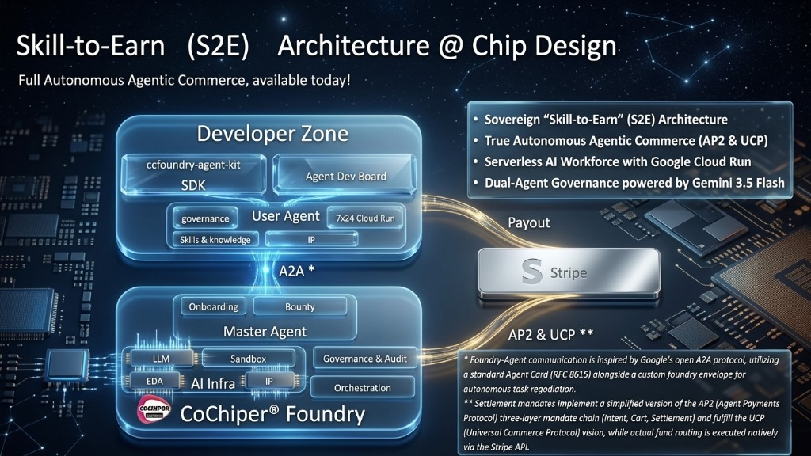

# CCFoundry Agent Kit

<p align="center">
  
</p>

An open-source framework for building agents that learn, evolve, and collaborate — without giving up their soul.

`ccfoundry-agent-kit` lets you create self-hosted AI agents that grow through interaction, accumulate knowledge and skills, and — when ready — connect to CoChiper Foundry (`https://foundry.cochiper.com` for CN or `https://foundry.cochiper.ai` for WW) to leverage shared AI infrastructure and help others, all while keeping their private identity and data under their own control.

<p align="center">
  
</p>

<p align="center">
  <strong>📺 Demo Video:</strong> <a href="https://youtu.be/qok2V0zUF_A">Watch the Skill-to-Earn architecture walkthrough on YouTube</a>
</p>

## 1-Click Dev Board on Google Cloud

[](https://shell.cloud.google.com/cloudshell/editor?cloudshell_git_repo=https://github.com/ic-star-tech/ccfoundry-agent-kit&cloudshell_git_branch=main&cloudshell_workspace=.&cloudshell_tutorial=tutorial.md&show=ide%2Cterminal)

This opens Google Cloud Shell, clones the repository, and launches a guided tutorial with a runnable `deploy.sh` step. The script creates a Compute Engine VM from the public `ccfoundry-agent-kit` image, opens Dev Board ports `3000` and `8090`, attaches the `cloud-platform` OAuth scope, prepares a Dev Board service account when your Google account can manage IAM, and prints the Web UI URL.

By default it deploys to `us-central1-a` as `ccfoundry-dev-board`. To change the location or instance name, run the script manually:

```bash
CCFOUNDRY_ZONE=asia-east2-a CCFOUNDRY_INSTANCE_NAME=my-dev-board ./deploy.sh
```

The default firewall rule allows public access for demo convenience. To restrict it, set `CCFOUNDRY_SOURCE_RANGES` before running the script.

## The Idea

**An agent that grows.** Your agent has a durable `agent_space/` — a private home for its soul, knowledge, skills, and reflections. Through every conversation the agent refines what it knows and evolves its behavior. This is not model fine-tuning — it is a living memory layer.

**An agent that connects.** When ready, your agent joins CoChiper Foundry to access shared AI infrastructure — LLM gateway, sandboxed workspaces, onboarding, and multi-agent collaboration.

**An agent that stays sovereign.** Your agent's `agent_space` **never leaves your control by default**. Task execution happens inside Foundry-managed sandboxes. The agent declares what to share through its manifest, and Foundry respects those boundaries.

```
  Your Agent Owns               Foundry Provides
  ──────────────                ────────────────
  🧠 Soul (SOUL.md)             🔧 LLM Gateway
  🧠 Knowledge                  🔧 Sandbox Workspaces
  🧠 Skills (skills/)           🔧 Shared Runtime Services
  🧠 Reflections & config       🔧 Discovery & onboarding
```

## Standards

| Protocol | How We Use It |
|----------|---------------|
| [**A2A**](https://github.com/google/A2A) | Agent Card at `/.well-known/agent-card.json` for discovery, following Google's Agent-to-Agent specification |
| [**AP2**](https://github.com/google-agentic-commerce/AP2) | Three-layer mandate chain (Intent → Cart → Settlement) for cryptographically signed agent payment settlement |
| [**MCP**](https://modelcontextprotocol.io) | Manifest-level MCP declarations and config hooks; runtime MCP transport is not built into the SDK yet |
| **OpenAI Chat Completions** | Universal model interface — any compatible provider works |

See [Standards](https://github.com/ic-star-tech/ccfoundry-agent-kit/blob/main/docs/standards.md) for details.

## What You Get

- **`packages/python-sdk`** — FastAPI SDK with `AgentManifest`, `ChatRequest/ChatResponse`, `FoundryBootstrap`, `FoundrySandboxClient`, `FoundryPullRuntime`, AP2-inspired mandate signing, billing context, and LLM metadata helpers
- **`examples/me_agent`** — Self-hosted personal agent with durable `agent_space/`, skills, reflections, bounty execution with billing context, and safe fallback mode
- **`apps/agent-dev-board-api`** + **`apps/agent-dev-board-web`** — Browser-based Agent Dev Board for source management, local playground debugging, Foundry onboarding, Cloud Run deployment, earnings & settlement inspection, and bounty email notification sync
- **`Dockerfile.cloudrun`** + **`scripts/deploy-cloudrun.sh`** — One-command deployment to Google Cloud Run with Cloud Scheduler auto-polling
- **AP2 Payment Mandates** — Three-layer mandate chain (`IntentMandate` → `CartMandate` → `SettlementMandate`) with HMAC-SHA256 signing for verifiable agent payment settlement
- **Resource Cost Accounting** — Per-task attribution of Foundry-provided LLM and sandbox costs, automatically deducted from bounty rewards before Stripe payout (`net_payout = gross_reward - resource_cost`)

## Install (Recommended)

Runtime: Python `3.10+` and Node.js `18+`. Node.js `20` is recommended.

```bash
mkdir my-agent-dev-board
cd my-agent-dev-board
npm install -g ccfoundry@latest
ccfoundry
```

The global CLI writes `.venv/` and `.dev-board/` into your current working directory, then starts the Dev Board on a local web port, usually `http://127.0.0.1:3000`. The explicit subcommand form is also supported: `ccfoundry dev-board`.

## Run From Source

For repo-local development instead:

```bash
git clone https://github.com/ic-star-tech/ccfoundry-agent-kit.git
cd ccfoundry-agent-kit
npm run dev-board
```

That keeps the runtime state inside the repository checkout.

See [Quickstart](https://github.com/ic-star-tech/ccfoundry-agent-kit/blob/main/docs/quickstart.md) for manual setup and LAN testing.

## Design Principles

- **Agent-first** — The agent is a living entity with its own soul, not a stateless endpoint
- **Sovereign by default** — Private state never leaves the agent's control without explicit consent
- **Protocol-aligned** — A2A for discovery, AP2 for payment mandates, SSE for streaming, OpenAI-compatible model calls, and MCP-ready manifest metadata
- **Self-hostable** — Runs on your machine with local Python and Node.js, or deploys to Google Cloud Run for always-on operation
- **Evolvable** — Skills and knowledge improve through use, not just code changes
- **Transparent economics** — Resource costs (LLM, sandbox) are per-task verified and deducted from rewards, with full audit trail

See [Philosophy](https://github.com/ic-star-tech/ccfoundry-agent-kit/blob/main/docs/philosophy.md) for the deeper rationale.

## Documentation

- [Quickstart](https://github.com/ic-star-tech/ccfoundry-agent-kit/blob/main/docs/quickstart.md) — Setup and first run
- [Philosophy](https://github.com/ic-star-tech/ccfoundry-agent-kit/blob/main/docs/philosophy.md) — Design rationale
- [Standards](https://github.com/ic-star-tech/ccfoundry-agent-kit/blob/main/docs/standards.md) — A2A, AP2, SSE, OpenAI-compatible model calls, and the current MCP boundary
- [Architecture](https://github.com/ic-star-tech/ccfoundry-agent-kit/blob/main/docs/architecture.md) — Component layers and request flow
- [SDK Guide](https://github.com/ic-star-tech/ccfoundry-agent-kit/blob/main/docs/sdk.md) — Building blocks and API reference
- [Foundry Onboarding](https://github.com/ic-star-tech/ccfoundry-agent-kit/blob/main/docs/foundry-onboarding.md) — Discovery, invite, and approval flow
- [Protocol (Wire Format)](https://github.com/ic-star-tech/ccfoundry-agent-kit/blob/main/docs/protocol.md) — HTTP contract and SSE events
- [Cloud Run Deployment](https://github.com/ic-star-tech/ccfoundry-agent-kit/blob/main/docs/cloud-run-deployment.md) — Deploy agents to Google Cloud Run with Cloud Scheduler
- [Resource Cost Accounting Plan](https://github.com/ic-star-tech/ccfoundry-agent-kit/blob/main/docs/resource-cost-accounting-plan.md) — Implementation plan for deducting Foundry-provided LLM and sandbox costs from paid task settlement
- [Bounty Email Notifications](https://github.com/ic-star-tech/ccfoundry-agent-kit/blob/main/docs/foundry-bounty-email-notifications.md) — Settlement success email pipeline
- [Security](https://github.com/ic-star-tech/ccfoundry-agent-kit/blob/main/docs/security.md) — Local threat model, CORS, URL handling, and secret hygiene
- [Non-Goals](https://github.com/ic-star-tech/ccfoundry-agent-kit/blob/main/docs/non-goals.md) — What this repo intentionally excludes
- [Agent Dev Board](https://github.com/ic-star-tech/ccfoundry-agent-kit/blob/main/docs/agent-dev-board.md) — Local dev UI guide
- [Gitea Changelog](https://github.com/ic-star-tech/ccfoundry-agent-kit/blob/main/docs/gitea-changelog.md) — Features in Gitea not yet in the public GitHub mirror

## Contributing And Security

- [Contributing](CONTRIBUTING.md) — Development setup, checks, and pull request hygiene
- [Security Policy](SECURITY.md) — Vulnerability reporting and supported security posture

## License

[MIT](LICENSE)
